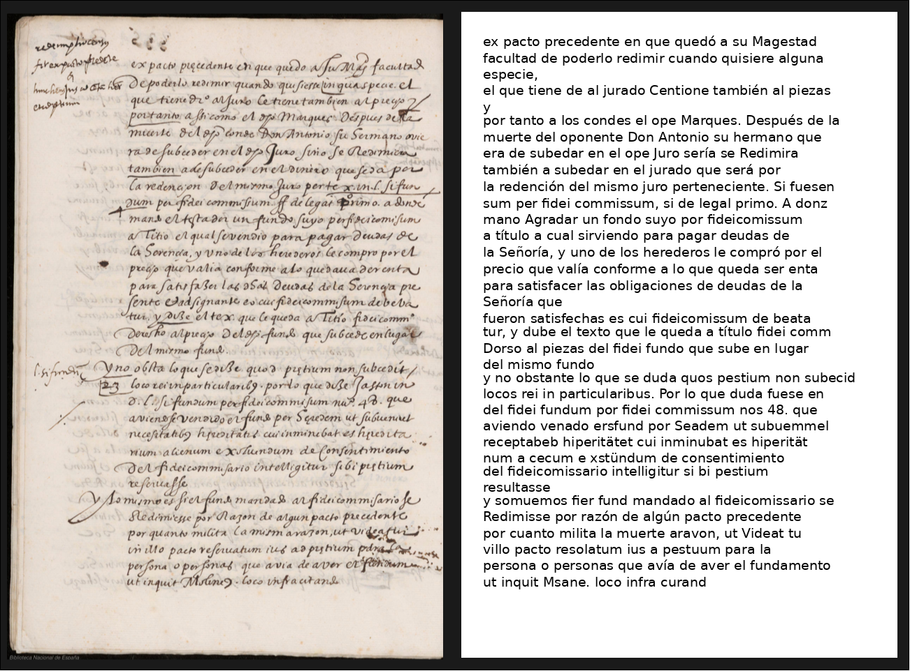
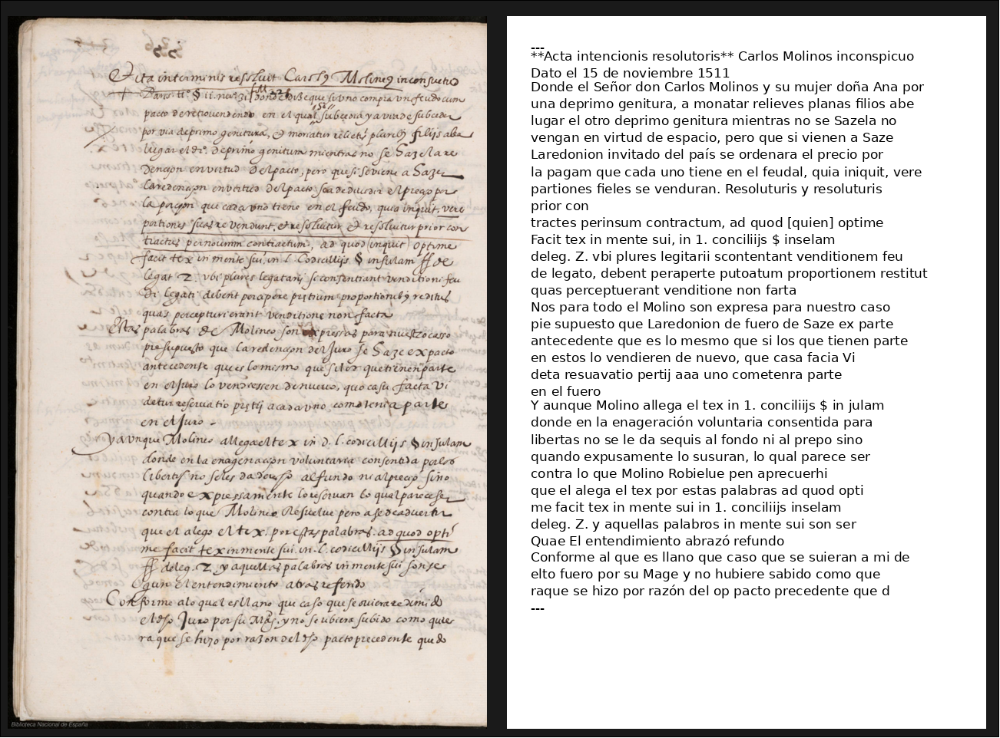
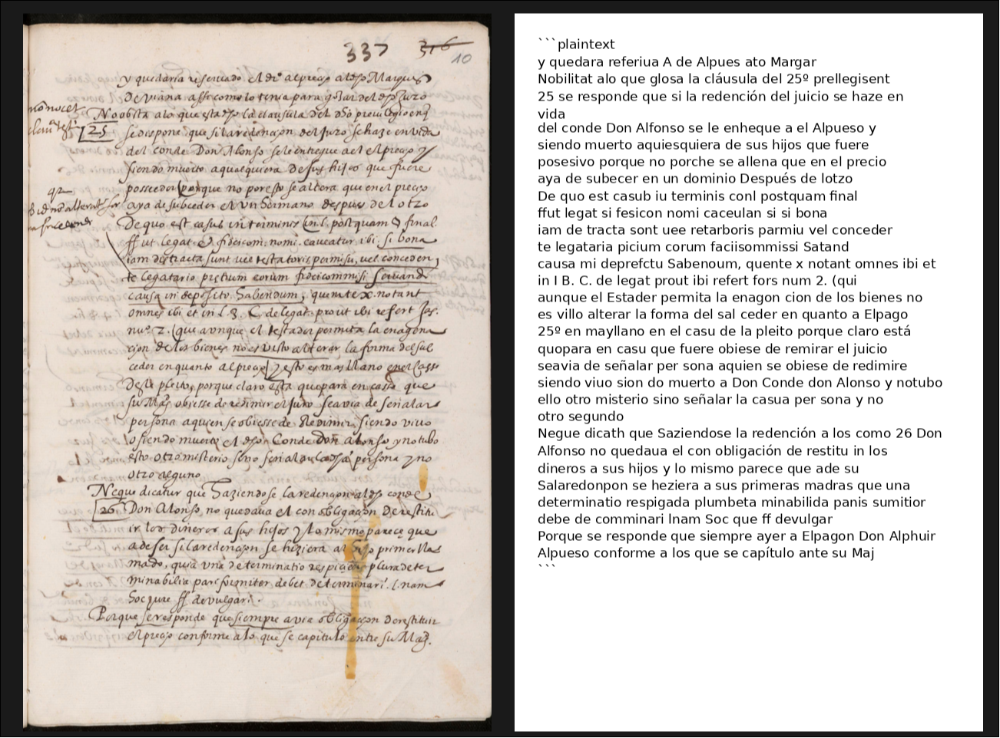
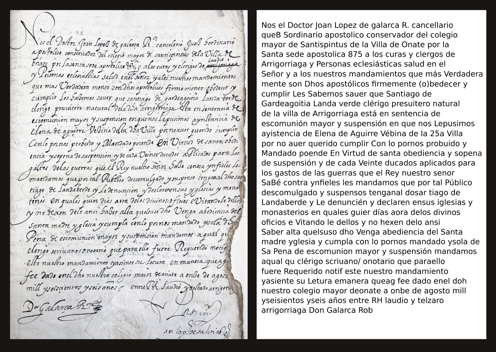
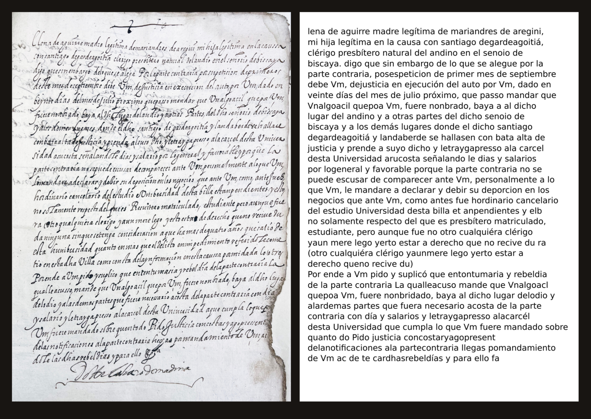
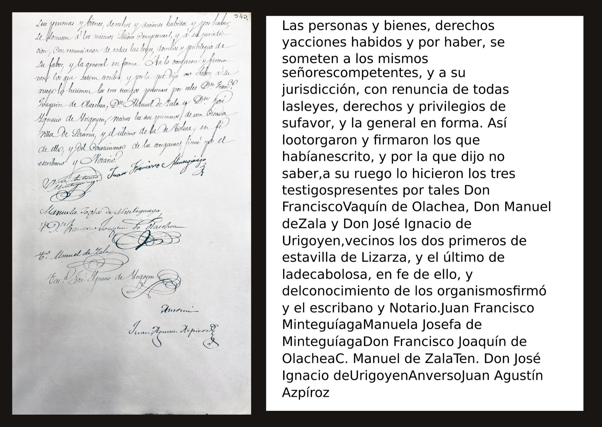

# End-to-end handwritten text recognition for early modern Spanish documents with LLM or Vision-Language Model pipeline creation

## **Abstract**

This project focuses on building an ***end-to-end Handwritten Text Recognition (HTR) pipeline*** for ***early modern Spanish manuscripts*** by placing a ***Vision-Language Model (VLM)*** at the center of every processing stage, rather than using it as a late-stage corrector. The system leverages ***Qwen2.5-VL-7B-Instruct*** with ***LoRA-based fine-tuning*** across a ***multi-task training strategy***, teaching the model both to ***faithfully read handwriting*** and to ***produce clean, corrected transcriptions***. A ***fine-tuned MIM-TrOCR model***, developed during ***GSoC 2025***, provides ***supplementary line-level evidence*** via ***OpenCV-based line segmentation***. The pipeline operates through ***four distinct stages***: ***document analysis***, ***line-level OCR***, ***literal reading***, and ***reconciliation/correction***, enabling robust transcription of ***degraded historical manuscripts***. Evaluated on the ***Rodrigo***, ***Orinoco***, and ***Tridis*** datasets, the system achieves competitive results, contributing to the development of ***VLM-driven pipelines*** for ***historical document analysis*** and the ***digital preservation*** of ***Renaissance textual heritage***.

---

##  **Approach**

### **1. Data Preparation**
- **Training Data**: Handwritten manuscript images and their corresponding ***ground-truth transcriptions***, provided by the project mentors, are used for ***fine-tuning***. Each image is paired with ***two complementary prompts***: (a) a ***literal reading prompt*** instructing the model to transcribe handwriting as it is, and (b) a ***corrected transcription prompt*** instructing the model to produce clean, error-free output. This dual-prompt structure ensures the model learns both ***faithful reading*** and ***intelligent correction***.
- **Evaluation Data**: The pipeline is evaluated on the ***Rodrigo***, ***Orinoco***, and ***Tridis*** datasets, containing diverse handwriting styles, archaic letterforms, and complex page layouts. Each evaluation image is paired with its ***ground-truth transcription*** for computing ***CER*** and ***WER*** metrics.

### **2. Fine-Tuning**
- ***LoRA-based fine-tuning*** (rank=16, alpha=32) is applied to ***Qwen2.5-VL-7B-Instruct*** for ***parameter-efficient adaptation*** on handwritten document images.
- ***Multi-task training*** with two complementary prompts per image teaches the model both to ***faithfully read handwriting*** and to ***produce clean, corrected output***.
- Training prompts are designed to ***exactly match inference prompts***, ensuring consistency between training and deployment.
- **Training Prompts**:

  **Prompt 1 — Literal Reading:**
  ```
  Quickly read the handwritten text in this image as literally as possible. Output only the raw text you can
  see, line by line, without any spelling corrections or interpretation. Include every word even if unclear.
  ```

  **Prompt 2 — Corrected Transcription:**
  ```
  Carefully read the handwritten text in the image. Write down the transcription. If you recognize obvious
  spelling errors or archaic abbreviations, output a corrected version of the text that likely represents
  the intended words. Provide ONLY the final corrected transcript, preserving the structure of the document.
  ```

- **Training Configuration**: batch size 1, gradient accumulation 2, learning rate 1e-5, 10 epochs, bf16 mixed-precision training.
- **Hardware**: NVIDIA A40/A100 GPUs via SLURM cluster.

### **3. Inference Pipeline Architecture**
The inference pipeline processes each document page through ***four stages***, with the ***VLM used at every stage*** and ***TrOCR providing supplementary evidence***:

| **Stage** | **Purpose** | **Description** |
|-----------|-------------|-----------------|
| **Stage 1** | Document Analysis | VLM identifies ***language***, ***time period***, ***legibility***, and ***special features*** of the handwritten page |
| **Stage 2a** | Line-Level OCR | TrOCR processes individual text lines extracted via ***OpenCV horizontal projection line segmentation*** |
| **Stage 2b** | Literal Reading | VLM reads the handwriting ***as it is***, line by line, without corrections (prompt aligned with fine-tuning) |
| **Stage 3** | Reconciliation & Correction | VLM ***reconciles both readings*** (TrOCR + VLM literal) using Stage 1 ***document analysis context*** and the ***original image*** as visual evidence, ***correcting errors***, ***archaic abbreviations***, and producing the ***final transcription*** |

### **4. Line Segmentation**
- ***OpenCV horizontal projection profiles*** are used to segment full manuscript page images into ***individual text lines***.
- Segmented line images are passed to ***TrOCR*** (a line-level model) for ***independent OCR***, producing per-line transcription candidates.
- This ***classical CV approach*** is robust, dependency-free, and works reliably across diverse manuscript layouts.

### **5. Decoding and Output Generation**
- ***Beam search decoding*** (4 beams) with ***repetition penalty*** (1.2) and ***n-gram blocking*** (no_repeat_ngram_size=10) to prevent the VLM from looping on difficult images.
- Produces ***visual transcription images***: predicted text rendered onto white pages matching ***original document dimensions*** for side-by-side comparison.
- Outputs ***structured results*** containing all intermediate outputs: document analysis, literal reading, TrOCR output, and final reconciled transcription.

### **6. Evaluation**
- The evaluation script runs the ***same pipeline*** on images with ground truth.
- Computes ***Character Error Rate (CER)*** and ***Word Error Rate (WER)*** per image using the ***jiwer*** library.
- Outputs a ***detailed CSV*** with all intermediate outputs per image and a ***summary statistics table***.

---

##  **Evaluation Metrics**

To evaluate the performance of the ***HTR pipeline***, two standard metrics are used:

### **Character Error Rate (CER)**
- CER measures the ***character-level edit distance*** between the predicted transcription and the ground truth, normalized by the length of the ground truth.
- A ***lower CER*** (closer to `0.0`) indicates higher transcription accuracy at the character level.
- CER captures fine-grained errors such as ***misrecognized letterforms***, ***missing diacritics***, and ***character substitutions*** common in historical handwriting.

### **Word Error Rate (WER)**
- WER measures the ***word-level edit distance*** between the predicted and ground truth transcriptions, normalized by the number of words in the ground truth.
- A ***lower WER*** (closer to `0.0`) indicates that the model produces transcriptions with fewer ***word-level errors***, including ***insertions***, ***deletions***, and ***substitutions***.
- WER is particularly important for ***downstream usability***, as word-level accuracy directly impacts the readability and utility of transcribed manuscripts for ***historians*** and ***linguists***.

Both metrics are computed per image and aggregated across the full dataset to provide ***best***, ***average***, ***median***, and ***worst-case*** performance statistics.

---

##  **Results Analysis**

### **Rodrigo Dataset**

| **Metric** | **Best (Min)** | **Average** | **Median** | **Worst (Max)** |
|-----------|----------------|-------------|------------|-----------------|
| **CER** | 0.000000 | 0.135706 | 0.107143 | 1.563636 |
| **WER** | 0.000000 | 0.460671 | 0.428571 | 1.454545 |

<br>

### **Orinoco Dataset**

| **Metric** | **Best (Min)** | **Average** | **Median** | **Worst (Max)** |
|-----------|----------------|-------------|------------|-----------------|
| **CER** | 0.091658 | 0.908369 | 0.281682 | 6.250000 |
| **WER** | 0.320988 | 0.855477 | 0.584654 | 7.022727 |

<br>

### **Tridis Dataset**

| **Metric** | **Best (Min)** | **Average** | **Median** | **Worst (Max)** |
|-----------|----------------|-------------|------------|-----------------|
| **CER** | 0.000000 | 0.550386 | 0.565789 | 2.368421 |
| **WER** | 0.000000 | 0.881366 | 1.000000 | 2.600000 |

---

## **Evaluation Summary**

### **Rodrigo Dataset**
The best CER of ***0.000000*** on multiple images indicates that the pipeline achieves ***perfect transcription*** on well-preserved pages with clear handwriting. The median CER of ***0.107143*** demonstrates that the pipeline consistently produces usable transcriptions across the majority of the 5010 image dataset, with ***approximately 89.3% character-level accuracy*** at the median. The median WER of ***0.428571*** reflects the challenge of historical handwriting at the word level, where ***archaic abbreviations***, ***irregular spacing***, and ***connected letterforms*** make word boundary detection difficult. The worst-case CER of 1.563636 corresponds to severely degraded or atypical pages where the model struggles, indicating room for improvement with ***larger VLM backends***.

### **Orinoco Dataset**
The Orinoco dataset represents a ***more challenging out-of-distribution*** evaluation. The best CER of ***0.091658*** shows the pipeline can achieve strong results even on this harder dataset. The median CER of ***0.281682*** and median WER of ***0.584654*** indicate that while the pipeline establishes a ***working baseline***, there is significant room for improvement. The high average CER (0.908369) is skewed by a small number of extremely difficult pages. These results directly motivate the ***multi-model approach*** proposed for GSoC, where ***larger and more capable VLM backends*** are expected to substantially improve performance on challenging manuscripts.

### **Tridis Dataset**
The Tridis dataset presents a ***distinct challenge*** with its mix of handwriting styles and document conditions. The best CER of ***0.000000*** confirms that the pipeline can achieve ***perfect transcription*** on certain well-preserved pages. However, the median CER of ***0.565789*** and median WER of ***1.000000*** indicate that the majority of images in this dataset are ***significantly harder*** than Rodrigo, likely due to ***greater variability in handwriting styles***, ***document degradation***, and ***limited overlap with the training distribution***. The average CER of ***0.550386*** reflects consistent difficulty across the dataset, unlike Orinoco where a few extreme outliers skewed the average. These results highlight the importance of ***expanded fine-tuning data*** and ***larger VLM backends*** to improve generalization across diverse manuscript collections.

---

##  **Sample Transcription Results**

<p align="center">
  
</p>

<p align="center">
  
</p>

<p align="center">
  
</p>

<p align="center">
  
</p>

<p align="center">
  
</p>

<p align="center">
  
</p>

> All image outputs are available in the [`results/Comparison/`](results/Comparison/) folder.

---

## **Key Design Decisions**

### **1. VLM at All Stages**
The VLM is not merely a late-stage post-processor. It drives ***every stage*** of the pipeline: document analysis, literal reading, and reconciliation/correction. This satisfies the core requirement of the project and enables the model to leverage ***visual context*** throughout the entire transcription process.

### **2. TrOCR as Supplementary OCR**
The ***fine-tuned MIM-TrOCR model***, developed during ***GSoC 2025***, provides an ***independent line-level reading*** that the VLM can cross-reference during correction. Critically, the pipeline ***works fully without TrOCR***, ensuring robustness when line segmentation fails or TrOCR is unavailable.

### **3. Multi-Task Fine-Tuning**
Training with ***two complementary prompts per image*** (literal reading + corrected transcription) teaches the model distinct skills. The training prompts ***exactly match inference prompts***, ensuring consistency and preventing distribution shift between training and deployment.

### **4. Repetition Control**
Historical manuscripts with repetitive patterns or degraded regions can cause VLMs to enter ***output loops***. The combination of ***no_repeat_ngram_size=10*** and ***repetition_penalty=1.2*** effectively prevents this while preserving the model's ability to produce legitimate repeated text.

### **5. Classical Line Segmentation**
The ***OpenCV horizontal projection profile*** approach for line segmentation is chosen for its ***robustness***, ***simplicity***, and ***zero training data requirement***. It reliably segments diverse manuscript layouts without introducing additional model dependencies.

---

##  **Future Improvements**

### **1. Multi-Model VLM Support**
Integrate ***multiple open-source VLM backends*** including larger ***Qwen2.5-VL variants*** (3B, 72B), ***InternVL***, and other competitive models, allowing users to trade off between ***speed*** and ***accuracy*** based on their hardware.

### **2. Batch Processing for Multi-Page Manuscripts**
Add support for processing ***entire multi-page manuscripts*** in a single run, with ***PDF input support***, ***automatic page ordering***, ***per-page error recovery***, and ***consolidated output*** in multiple formats.

### **3. Desktop Application and CLI Tool**
Package the pipeline as a ***locally-run desktop application*** with an interactive ***Gradio interface*** and a ***pip-installable CLI tool*** for scriptable, reproducible transcription workflows.

### **4. Improved Line Segmentation**
Augment the classical OpenCV approach with a ***learned segmentation model*** for improved robustness on documents with ***marginalia***, ***annotations***, and ***multi-column layouts***.

### **5. Expanded Dataset Coverage**
Fine-tune and evaluate across a broader range of ***historical manuscript collections*** from ***BNE***, ***Europeana***, and other digital archives to improve ***generalization*** across diverse handwriting styles and document conditions.

### **6. Multilingual Adaptation**
Extend the pipeline to support ***other historical languages and scripts*** beyond Spanish, leveraging the ***multilingual capabilities*** of modern VLMs.

---

##  **Tech Stack**

| **Component** | **Tool / Library** |
|---------------|-------------------|
| VLM | Qwen2.5-VL-7B-Instruct + LoRA (PEFT) |
| OCR | Fine-tuned MIM-TrOCR (line-level recognition, developed during GSoC 2025) |
| Line Segmentation | OpenCV horizontal projection profiles |
| Metrics | Character Error Rate (CER), Word Error Rate (WER) |
| Hardware | NVIDIA A40/A100 GPUs via SLURM |

---

##  **Download Models**

### **Base VLM Model**
Download the base Qwen2.5-VL-7B-Instruct model from Hugging Face:

```bash
python -c "from huggingface_hub import snapshot_download; snapshot_download(repo_id='Qwen/Qwen2.5-VL-7B-Instruct', local_dir='models/Qwen2.5-VL-7B-Instruct', local_dir_use_symlinks=False)"
```

### **Fine-tuned TrOCR Model** (developed during GSoC 2025)

```bash
python -c "from huggingface_hub import snapshot_download; snapshot_download(repo_id='aniket-junghare/mim-trocr-gsoc25', local_dir='models/mim-trocr-gsoc25')"
```

### **VLM LoRA Weights**
Running `finetune.py` will generate the LoRA adapter weights in the `models/qwen2.5-vl-ocr-lora/` directory. If you want to skip fine-tuning and use the pre-trained weights directly:

```bash
python -c "from huggingface_hub import snapshot_download; snapshot_download(repo_id='aniket-junghare/qwen2.5-vl-ocr-lora-handwritten', local_dir='models/qwen2.5-vl-ocr-lora-handwritten', local_dir_use_symlinks=False)"
```

---

##  **Download Datasets**

### **Rodrigo Dataset**

```bash
python -c "from huggingface_hub import snapshot_download; snapshot_download(repo_id='aniket-junghare/Rodrigo', repo_type='dataset', local_dir='data/Rodrigo_eval', local_dir_use_symlinks=False)"
```

### **Orinoco Dataset**

```bash
python -c "from huggingface_hub import snapshot_download; snapshot_download(repo_id='aniket-junghare/Orinoco_Expedition', repo_type='dataset', local_dir='data/Orinoco_eval', local_dir_use_symlinks=False)"
```

### **Tridis Dataset**

```bash
python -c "from huggingface_hub import snapshot_download; snapshot_download(repo_id='aniket-junghare/Tridis', repo_type='dataset', local_dir='data/Tridis_eval', local_dir_use_symlinks=False)"
```

> Training data (`data/Handwriting-scans/` and `data/Handwriting-transcriptions/`) is included directly in the repository.

---

##  **Repository Structure**

```
GSoC26/
├── README.md                                        # Project overview, approach, results, and usage guide
├── requirements.txt                                 # Python dependencies
│
├── finetune.py                                      # Fine-tuning: LoRA training of Qwen2.5-VL-7B-Instruct
├── inference.py                                     # Inference: 4-stage VLM+TrOCR pipeline + visual output
├── evaluate.py                                      # Evaluation: CER/WER metrics + CSV report
│
├── notebooks/
│   ├── gsoc_2026_workflow_handwritten.ipynb         # Jupyter notebook demonstrating the full pipeline
│   └── gsoc_2026_workflow_handwritten.pdf           # PDF export of notebook with outputs
│
├── scripts/
│   ├── run_finetune.sh                              # SLURM script for fine-tuning
│   ├── run_inference.sh                             # SLURM script for inference
│   └── run_eval.sh                                  # SLURM script for evaluation
│
├── models/                                          # Model weights (download separately)
│   ├── Qwen2.5-VL-7B-Instruct/                      # Base VLM model
│   ├── qwen2.5-vl-ocr-lora-handwritten              # LoRA adapter weights (output of finetune.py)
│   └── mim-trocr-gsoc25/                            # Fine-tuned TrOCR model (developed during GSoC 2025)
│
├── data/                                            # Datasets (download separately)
│   ├── Handwriting-scans/                           # Training images (used by finetune.py)
│   ├── Handwriting-transcriptions/                  # Training ground truth (used by finetune.py)
│   ├── given_test_images_handwritten/               # Test images (used by inference.py)
│   ├── Rodrigo_eval/                                # Directory having image-transcription pairs (used by evaluate.py)
│   |── Orinoco_eval/                                # Directory having image-transcription pairs (used by evaluate.py)
│   └── Tridis_eval/                                 # Directory having image-transcription pairs (used by evaluate.py)
|
└── results/                                         # Pipeline outputs
    ├── Visual_Results/                              # Generated visual transcription images
    ├── Comparison/                                  # Side-by-side original vs transcription comparisons
    |── Rodrigo_evaluation_results.csv               # Evaluation CSV with per-image metrics 
    |── Orinoco_evaluation_results.csv               # Evaluation CSV with per-image metrics
    └── Tridis_evaluation_results.csv                # Evaluation CSV with per-image metrics
```

---


##  **Implementation Guide**

Refer to this [**notebook**](notebooks/gsoc_2026_workflow_handwritten.ipynb) for the inference guideline.

### **1. Install Required Packages**

Ensure that you have the required packages installed by running:

```bash
pip install -r requirements.txt
```

### **2. Fine-Tuning**

Run the fine-tuning script to adapt the VLM on historical manuscript data:

```bash
python -u finetune.py \
  --model-dir models/Qwen2.5-VL-7B-Instruct \
  --image-dir data/Handwriting-scans \
  --gt-dir data/Handwriting-transcriptions \
  --output-dir models/qwen2.5-vl-ocr-lora-handwritten
```

### **3. Run Inference Pipeline**

Process a manuscript image through the full 4-stage pipeline:

```bash
python -u inference.py \
  --model-dir models/Qwen2.5-VL-7B-Instruct \
  --lora models/qwen2.5-vl-ocr-lora-handwritten/final \
  --image-dir data/given_test_images_handwritten \
  --output-visual results/Visual_Results \
  --trocr models/mim-trocr-gsoc25
```

### **4. Run Evaluation**

Evaluate the pipeline on a dataset with ground truth transcriptions:

```bash
python -u evaluate.py \
  --model-dir models/Qwen2.5-VL-7B-Instruct \
  --lora models/qwen2.5-vl-ocr-lora-handwritten/final \
  --image-dir data/Rodrigo_eval/Rodrigo_Images \
  --gt-dir data/Rodrigo_eval/Rodrigo_Transcriptions \
  --output-csv results/Rodrigo_evaluation_results.csv
```
